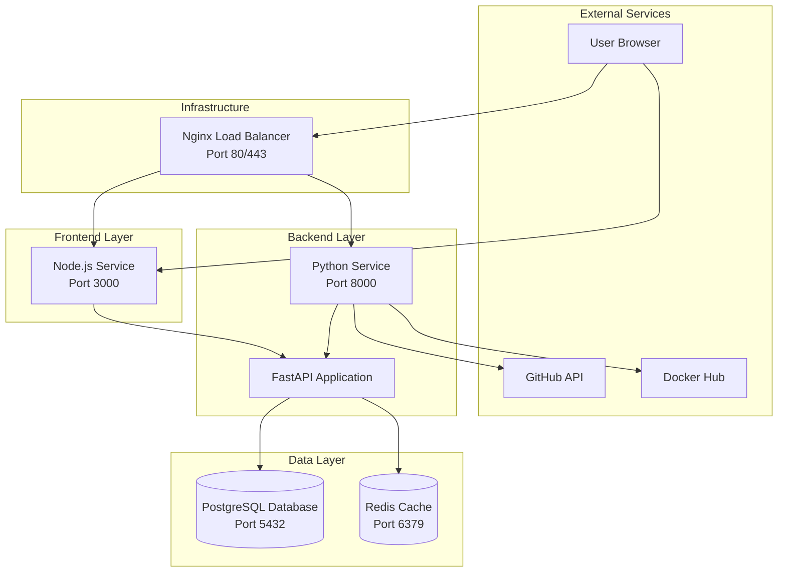

# Docker Compose Examples - Architecture

This document describes the architecture of the Docker Compose Examples project, including service relationships, data flow, and deployment patterns.

## System Architecture

## Service Components

### Frontend Services

#### Node.js Service
- **Purpose**: Serves the React/Vite frontend application
- **Port**: 3000
- **Technology**: Node.js 22, Vite, React
- **Dependencies**: PostgreSQL (for data), Python API (for backend)

### Backend Services

#### Python Service
- **Purpose**: FastAPI backend application providing REST API
- **Port**: 8000
- **Technology**: Python 3.14, FastAPI, Uvicorn
- **Dependencies**: PostgreSQL, Redis, External APIs

### Data Services

#### PostgreSQL
- **Purpose**: Primary relational database
- **Port**: 5432
- **Version**: Latest
- **Features**: 
  - Docker secrets for password management
  - Persistent volumes for data
  - Health checks
  - Custom initialization scripts

#### Redis
- **Purpose**: Caching and session management
- **Port**: 6379
- **Version**: Latest
- **Features**:
  - In-memory data storage
  - Pub/Sub messaging
  - Session storage

### Infrastructure Services

#### Nginx (Cluster Mode)
- **Purpose**: Load balancing and reverse proxy
- **Port**: 80, 443
- **Configuration**: Round-robin load balancing
- **Upstream**: Multiple Python/Node instances

## Data Flow

### Request Flow
1. User requests reach Nginx load balancer
2. Nginx routes requests to appropriate service (Node.js or Python)
3. Node.js serves static frontend assets
4. Frontend makes API calls to Python backend
5. Python processes requests, queries PostgreSQL/Redis
6. Responses flow back through the chain

### Data Persistence
- PostgreSQL data: Stored in `docker_examples_db_data` volume
- PostgreSQL logs: Stored in `docker_examples_db_logs` volume
- Redis data: Ephemeral (in-memory only)
- Application cache: Stored in respective cache volumes

## Network Architecture

All services communicate over internal Docker networks:
- `basic-stack-network`: For basic-stack deployment
- `cluster-network`: For cluster-example deployment
- `swarm-overlay`: For swarm-stack deployment (overlay network)

## Security Architecture

### Secret Management
- Database passwords stored in Docker secrets
- Secrets mounted as files in `/run/secrets/`
- Environment variables reference secret files
- `.gitignore` prevents secret files from being committed

### Network Isolation
- Services isolated in Docker networks
- Only exposed ports are accessible externally
- Internal communication uses service names

### User Permissions
- Containers run as non-root users (UID 1001)
- Minimal system dependencies installed
- Read-only filesystem where possible

## Deployment Patterns

### Basic Stack
Single-instance deployment for development:
- One instance of each service
- Development-focused configuration
- Quick startup and teardown

### Cluster Example
Multiple instances with load balancing:
- 3 Python service replicas
- Nginx load balancer
- Production-like configuration

### Swarm Stack
Docker Swarm orchestration:
- Service replicas managed by Swarm
- Overlay networking
- Service discovery
- Rolling updates

## Health Checks

All services implement health checks:
- **Interval**: 30s
- **Timeout**: 10s
- **Retries**: 3
- **Start Period**: 40s

Health check commands:
- PostgreSQL: `pg_isready`
- Python: `python -c "import sys; sys.exit(0)"`
- Node.js: `curl -f http://localhost:3000/`
- Redis: `redis-cli ping`

## Monitoring and Observability

### Logs
- Container logs via `docker logs`
- Centralized logging (optional: ELK or Loki)
- Log rotation policies

### Metrics
- Container metrics via Docker stats
- Application metrics (optional: Prometheus)
- Custom application metrics

### Tracing
- Request tracing (optional: Jaeger)
- Distributed tracing across services
