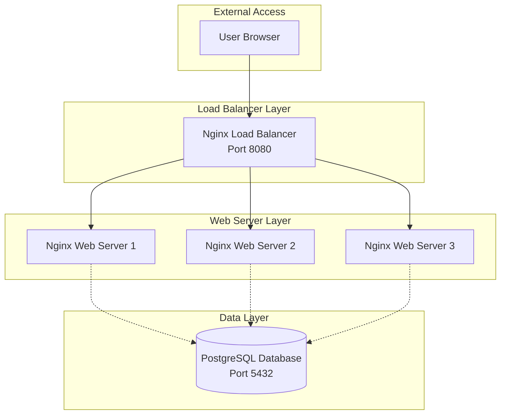

# Docker Cluster Implementation - Architecture

This document describes the architecture of the Docker cluster implementation, including service relationships, data flow, and deployment patterns.

## System Architecture



## Service Components

### Load Balancer

#### Nginx Load Balancer
- **Purpose**: Distributes incoming traffic across multiple web servers
- **Port**: 8080 (external)
- **Technology**: Nginx on Alpine Linux
- **Features**:
  - Round-robin load balancing
  - Health check integration
  - Upstream server monitoring
  - Graceful failover
  - Non-root user execution

### Web Servers

#### Nginx Web Servers (web1, web2, web3)
- **Purpose**: Serve static content with high availability
- **Replicas**: 3 instances
- **Technology**: Nginx on Alpine Linux
- **Features**:
  - Static content serving
  - Caching layer
  - Health monitoring
  - Horizontal scalability
  - Non-root user execution
- **Content**: Mounted from `web-content/` directory

### Database

#### PostgreSQL
- **Purpose**: Persistent data storage
- **Port**: 5432 (external)
- **Version**: PostgreSQL 16
- **Features**:
  - Docker secrets for password management
  - Persistent volumes for data
  - Transaction logging
  - Health checks via pg_isready
  - Custom configuration
  - Non-root user execution

## Data Flow

### Request Flow
1. User browser sends HTTP request to load balancer (port 8080)
2. Nginx load balancer receives request
3. Load balancer selects web server using round-robin algorithm
4. Selected web server processes request and serves static content
5. Response flows back through load balancer to user
6. Load balancer monitors web server health continuously

### Health Check Flow
1. Docker Compose health check executes curl command
2. Service responds with status
3. Docker marks service as healthy/unhealthy
4. Dependent services wait for health confirmation
5. Load balancer only routes to healthy servers

### Data Persistence
- PostgreSQL data: Stored in `docker_examples_db_data` volume
- PostgreSQL logs: Stored in `docker_examples_db_logs` volume
- Redis data: Ephemeral (in-memory only)

## Network Architecture

Services communicate over the `cluster-network` bridge network:
- Internal DNS resolution via service names
- Isolated from external networks
- Secure inter-service communication
- Only specified ports exposed externally

### Network Configuration
```yaml
networks:
  cluster-network:
    driver: bridge
```

## Storage Architecture

### Persistent Volumes
- `cluster_db_data`: PostgreSQL data persistence
- `cluster_db_logs`: PostgreSQL transaction and error logs
- `cluster_nginx_cache`: Nginx caching for performance

### Volume Configuration
All volumes use local driver for simplicity:
```yaml
volumes:
  cluster_db_data:
    driver: local
```

## Security Architecture

### Secret Management
- Database passwords stored in Docker secrets
- Secrets mounted as read-only files in `/run/secrets/`
- Environment variables reference secret files
- `.gitignore` prevents secret files from being committed
- File permissions: 600 (read/write for owner only)

### Network Isolation
- Services isolated in Docker bridge network
- Only ports 8080 and 5432 exposed externally
- Internal communication uses service names
- No direct external access to web servers

### User Permissions
- All containers run as non-root users
- Nginx runs as user `nginx` (UID 101)
- PostgreSQL runs as user `postgres` (UID 999)
- Minimal system dependencies installed
- Read-only volumes where possible

### Security Best Practices
- Alpine Linux base images for minimal attack surface
- Regular security updates via base image rebuilds
- No hardcoded credentials
- Principle of least privilege
- Health checks for service monitoring

## Deployment Pattern

### Cluster Implementation
Production-ready multi-instance deployment:
- Nginx load balancer for traffic distribution
- 3 web server replicas for high availability
- PostgreSQL database for persistent storage
- Health checks for all services
- Graceful degradation on failures

### Scaling Strategy
Horizontal scaling of web servers:
```bash
docker-compose up -d --scale web1=5 --scale web2=5 --scale web3=5
```

Load balancer automatically detects and routes to available instances.

## Health Checks

All services implement comprehensive health checks:
- **Interval**: 30s (time between health checks)
- **Timeout**: 10s (maximum time for health check)
- **Retries**: 3 (failures before marking unhealthy)
- **Start Period**: 40s (time before first health check)

### Health Check Commands
- **Load Balancer**: `curl -f http://localhost`
- **Web Servers**: `curl -f http://localhost`
- **PostgreSQL**: `pg_isready -U cluster_user -d clusterdb`

### Health Check Benefits
- Automatic service recovery
- Load balancer failover
- Dependency management
- Service orchestration
- Monitoring integration

## Performance Optimization

### Build Performance
- Multi-stage Dockerfiles for minimal image size
- BuildKit caching for faster builds
- Layer caching strategy
- Optimized dependency installation

### Runtime Performance
- Nginx caching layer
- Named volumes for persistent data
- Efficient resource allocation
- Health-based routing
- Connection pooling

### Resource Limits
Configure in docker-compose.yml:
```yaml
deploy:
  resources:
    limits:
      cpus: '1.0'
      memory: 512M
    reservations:
      memory: 256M
```
